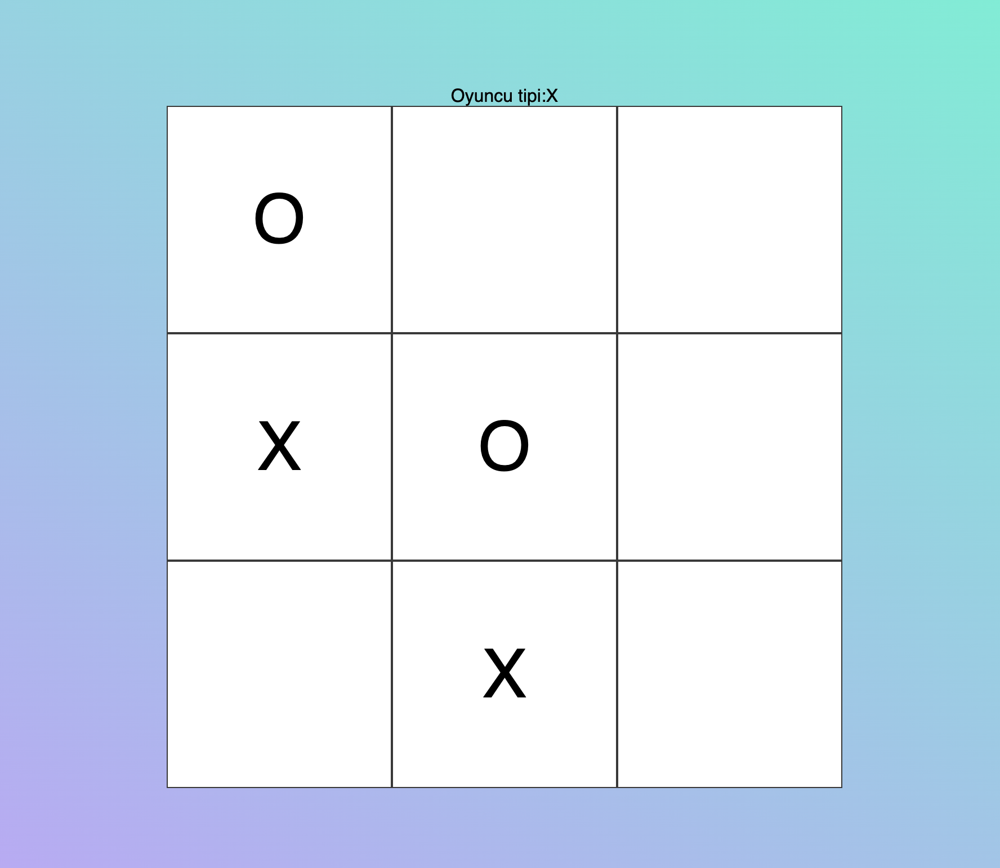
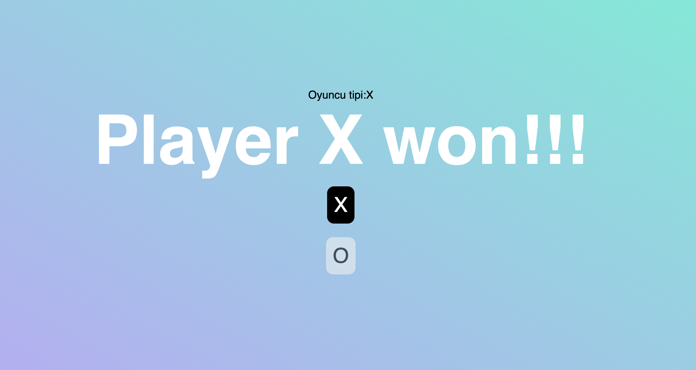

# X O X Game

This project includes an XOX (Tic-Tac-Toe) game developed using Angular and Socket.IO. This README file explains how to set up, run and customize the project.



## Requirements


- Node.js and npm must be installed.
- Angular CLI must be installed.
- The Socket.IO server should be started as needed.


## Run it on your computer

Clone the project

```bash
  git clone https://github.com/elselif/tictac
```

Go to the project directory

```bash
  cd tic
```

Install required packages
```bash
  npm install
```


```bash
  ng serve
```
```bash
  npm start
```

  ## Contribution

If you would like to contribute to this project, please create a fork and create a pull request to submit your contributions. We welcome your contributions!
